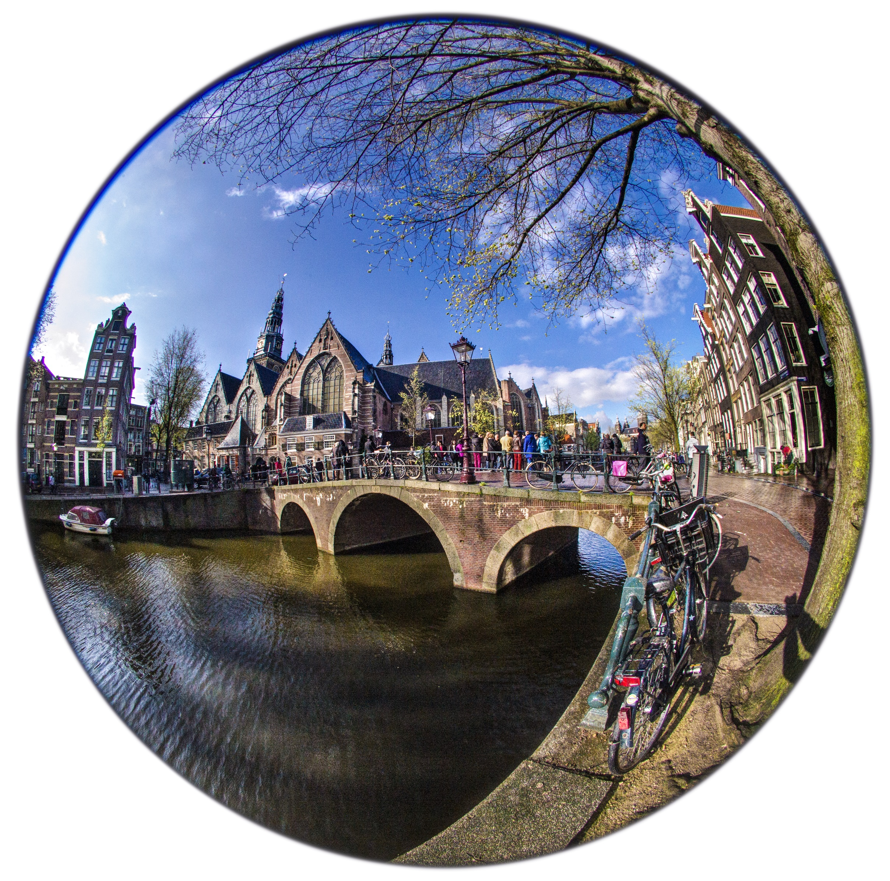
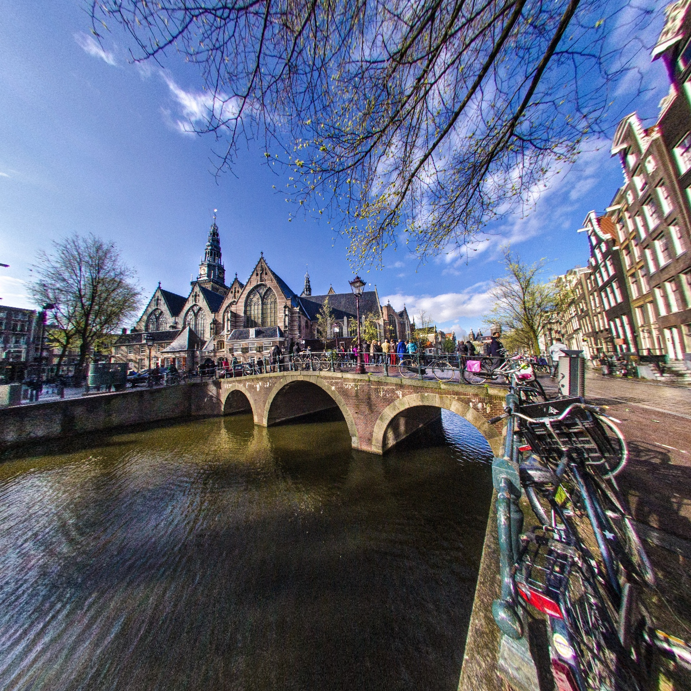
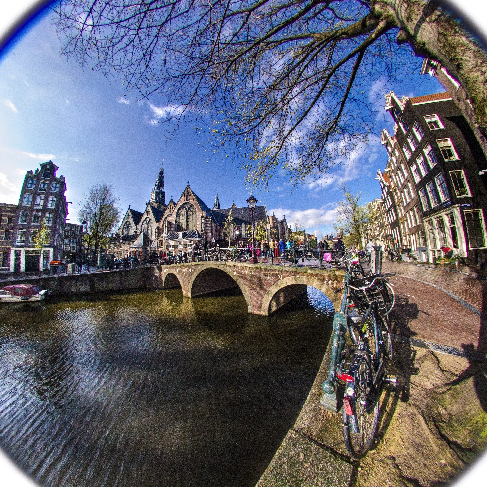
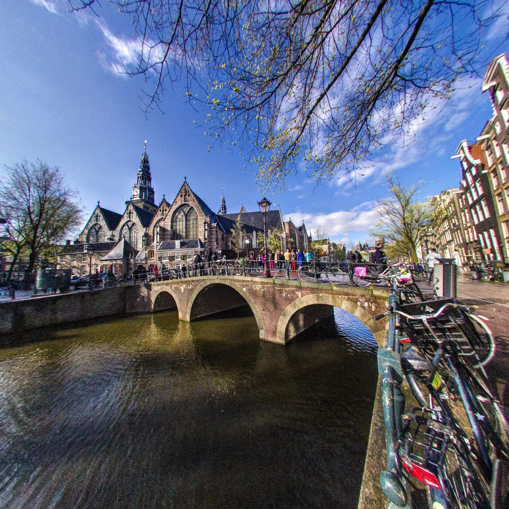
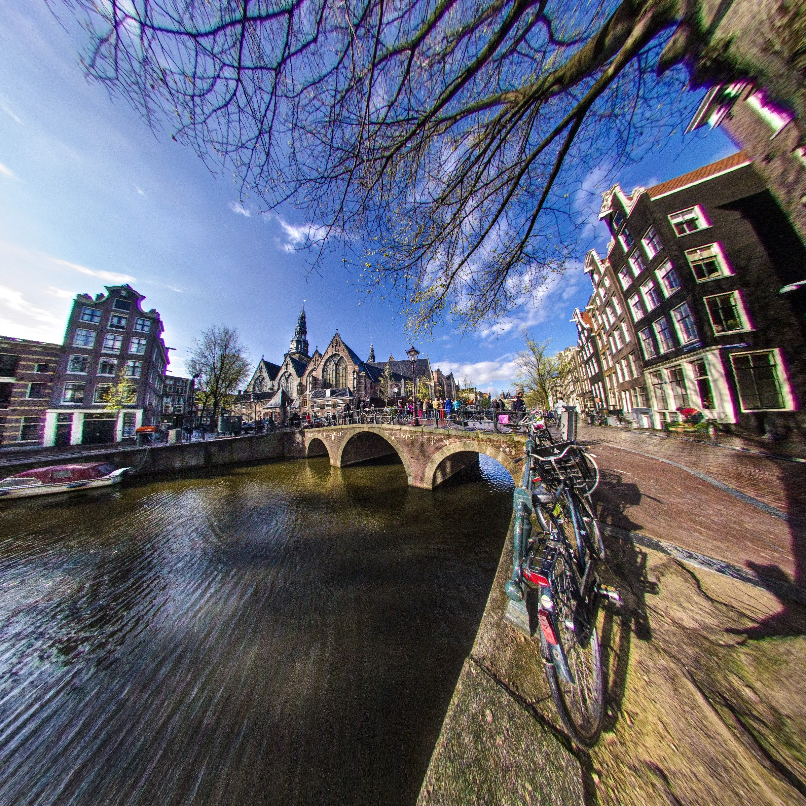
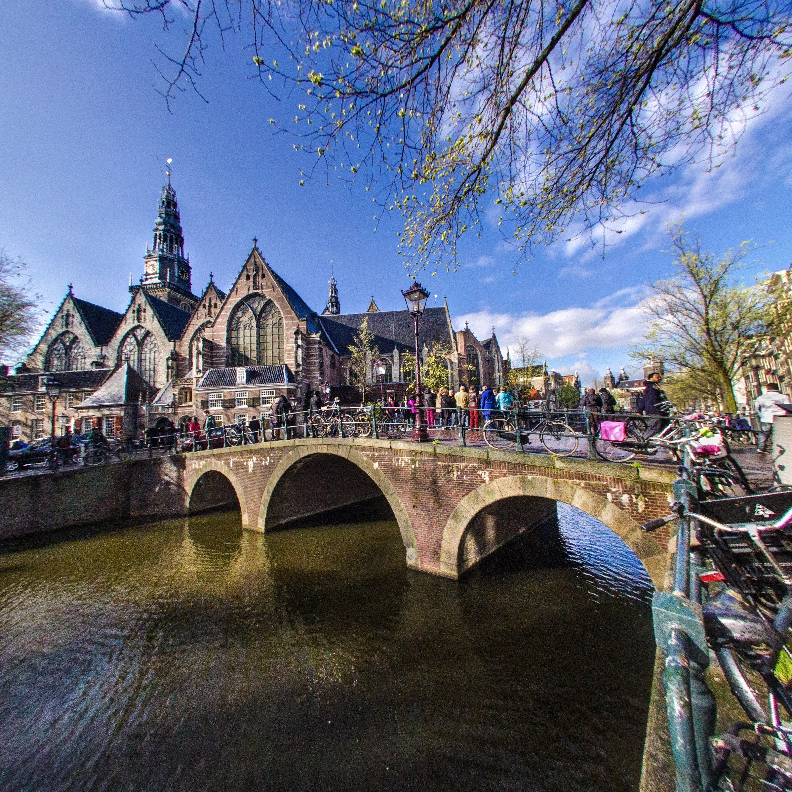

# Defisheye

Fast Corrects for fisheye distortion in an image.

Defisheye is designed to transform a fisheye image into a normal perspective
view looking towards the center of the fisheye image.

## Install

```bash
python setup.py install
```

or:

```bash
pip install defisheye
```

## Usage

```python
from defisheye import Defisheye

dtype = 'linear'
format = 'fullframe'
fov = 180
pfov = 120

img = "./images/example3.jpg"
img_out = f"./images/out/example3_{dtype}_{format}_{pfov}_{fov}.jpg"

obj = Defisheye(img, dtype=dtype, format=format, fov=fov, pfov=pfov)

# To save image locally 
obj.convert(outfile=img_out)

# To use the converted image in memory

new_image = obj.convert()
```


## Constructor atributes:
### fov
fisheye field of view (aperture) in degrees.


IFOV is the input fisheye image field of view in degrees. A value of 180
will correspond to a hemispherical fisheye image within the circular area.
Values are floats in the range 0<ifov<=180. The default is 180 degrees for a
full hemisphere.


### pfov
perspective field of view (aperture) in degrees.


OFOV is the output perspective image field of view in degrees. Values are
floats in the range 0<ofov<180. The default is to use 120 degrees both
vertically and horizontally for a circular fisheye and diagonally for a full
frame fisheye. The value for ofov relative to the ifov determines the
proportional amount of the fisheye area that will be transformed.
Note that in comparison, a value of 48.8 degrees corresponds to a diagonal
field of view from a 35 mm camera (film size 36mm x 24mm) with a 50mm focal
length lens, i.e. a "normal" view. Similarly, when the image diagonal is
equal to the focal length of the camera, the field of view is about 53.1
degrees. Although the default value is perhaps not appropriate to a
normal perspective image, this will produce an image that maximizes the
area covered, but without too much distortion. If the original fisheye
image was viewed obliquely, i.e. the camera was tilted between horizontal
and vertical, then the resulting perspective view will have perspective
distortion. That is  vertical edges will be tilted outward or inward.
Post processing with my 3Drotate or rotate3D script will then correct
for this perspective distortion. Perspective distortion will be more
pronounced with larger values for ofov.

### dtype
linear, equalarea, orthographic, stereographic

TYPE is the type of fisheye lens. The choices are: linear (equidistant),
equalarea (equisolid), orthographic and stereographic. The default is linear.

### format
circular, fullframe

FORMAT is the format of the fisheye lens image. The choices are:
circular (image fills a circle that spans the minimum of the width or height)
or fullframe (image spans a circle that spans the diagonal dimension).
The default is circular.

### xcenter
x center of fisheye area


### ycenter
y center of fisheye area

### radius
radius of fisheye area

RADIUS is the radius of the fisheye circular area in the input image.
Values are floats greater than zero. The default is half the minimum value
between the input image width and height.

### angle
image rotation in degrees clockwise

ANGLE is the clockwise positive rotation angle for the output perspective
image relative to the orientation of the input fisheye image. Values are
non-negative floats in range 0<=angle<360. The default is 0.

## Example

Original


pfov = 120

Equal area  Circular


Equal area Fullframe


Linear  Circular


Linear Fullframe


orthographic  Circular


Stereographic Circular



## Extra
Developed by: E. S. Pereira.
e-mail: pereira.somoza@gmail.com

Based in the work of F. Weinhaus.
http://www.fmwconcepts.com/imagemagick/defisheye/index.php

Copyright [2019] [E. S. Pereira]

   Licensed under the Apache License, Version 2.0 (the "License");
   you may not use this file except in compliance with the License.
   You may obtain a copy of the License at

       http://www.apache.org/licenses/LICENSE-2.0

   Unless required by applicable law or agreed to in writing, software
   distributed under the License is distributed on an "AS IS" BASIS,
   WITHOUT WARRANTIES OR CONDITIONS OF ANY KIND, either express or implied.
   See the License for the specific language governing permissions and
   limitations under the License.
