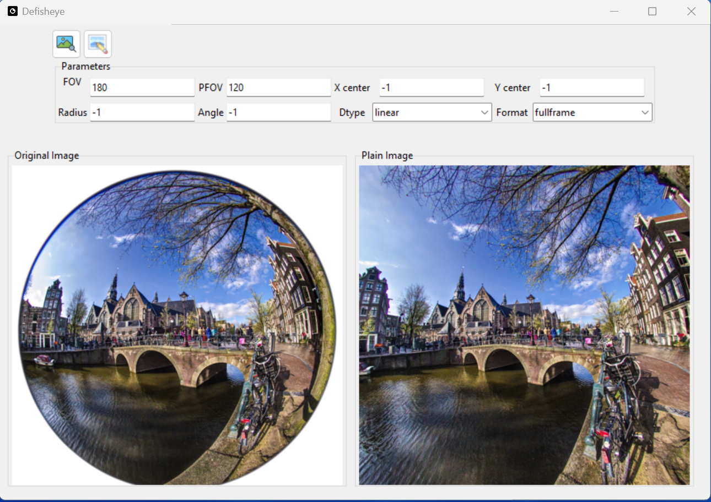

# Summary

The Defisheye toolkit is a powerful tool for transforming distorted fisheye images into normal perspective views. Built using Python, it consists of a command-line interface for processing large quantities of images, as well as a graphical user interface designed specifically for visual analysis to determine the best parameters for a given lens. In addition, the toolkit includes an application programming interface (API) that allows users to access its functionality directly in Python scripts.  The Defisheye toolkit's versatility and compatibility with various hardware and software configurations make it an accessible option for many users. Whether processing a large number of images or conducting detailed visual analysis, the Defisheye toolkit provides an efficient and effective solution for transforming fisheye images into normal perspective views.


# Statement of need

Total Sky cameras are compact equipment equipped with a fisheye objective lens that covers a field-of-view (FOV) of 180° (@kreuter:2009). However, the images captured with this lens are distorted, making it necessary to convert the curved image into a flat image for practical use. This is where the defisheye algorithm comes in handy, as it is designed to transform a fisheye image into a normal perspective view looking towards the center of the fisheye image.

Defisheye algorithms are essential for ensuring the practical applicability of fisheye images. By transforming distorted fisheye images into normal perspective views, these algorithms enable accurate and effective analysis in a wide range of applications. For instance, in the field of security and surveillance, fisheye cameras with defisheye algorithms can capture a wider field-of-view and provide a more comprehensive view of a monitored area, which can enhance overall security and safety.

Sky images captured by fisheye cameras with defisheye algorithms have numerous applications, particularly in meteorology and climate research. These cameras can provide valuable data on cloud cover, atmospheric conditions, and weather patterns by capturing panoramic views of the sky. In particular, using a sequence of total sky images, it is possible to estimate cloud velocity, which is crucial in the nowcasting of electricity production by solar energy farms.

The Python package presented here has previously been used in the work of @pereira:2020. In that study, the author utilized the normal perspective view image generated by the defisheye algorithm to classify clouds by thickness using a genetic algorithm. The package's transforming algorithm was implemented based on the works of @otto:2007 and @Weinhaus:2018, which provided the base equations.

Moreover, the presented Python package has a wide range of applications. With the ability to transform distorted fisheye images into normal perspective views, this package can be used to analyze a variety of data, from surveillance footage to sky imaging in meteorology and astronomy. The package's efficient algorithms and easy-to-use interface make it a valuable tool for researchers and professionals in various fields. Additionally, its compatibility with various hardware and software configurations makes it an accessible option for many users.

# Features

The Defisheye GUI is a tool used to estimate the best parameters for mapping fisheye images into normal perspective views. The GUI application can be found in the toolkit, as shown in \autoref{fig:defisheyeapp}. 

The package is available in Pypi repository [https://pypi.org/project/defisheye/](https://pypi.org/project/defisheye/), and can be installed using the command:

```bash
pip install defisheye
```

The parameters that can be adjusted using the GUI are:

1. fov: field-of-view (aperture) in degrees. the input fisheye image field of view in degrees. A value of 180 will correspond to a hemispherical fisheye image within the circular area. Values are in the range $0< fov <=180$. The default is 180 degrees for a
full hemisphere.

2. pfov: perspective-field-of-view (aperture) in degrees. pfov is the output perspective image field of view in degrees. Values are in the range $0<pfov<180$. The default is to use 120 degrees both vertically and horizontally for a circular fisheye and diagonally for a full frame fisheye. The value for pfov relative to the fov determines the proportional amount of the fisheye area that will be transformed.

3. dtype: the type of fisheye lens: linear, equalarea, orthographic, stereographic. The default is linear.

4. format: the format of the fisheye lens image. The choices are: circular (image fills a circle that spans the minimum of the width or height) or fullframe (image spans a circle that spans the diagonal dimension). The default is circular.

5. radius: the radius of the fisheye circular area in the input image. Values are floats greater than zero. The default is half the minimum value between the input image width and height.

6. angle: the clockwise positive rotation angle for the output perspective image relative to the orientation of the input fisheye image. Values are non-negative floats in range $0<=angle<360$. The default is 0.

7. xcenter: x center of fisheye area. Default the center of image.

8. ycenter: y center of fisheye area. Default the center of image.




In summary, the Defisheye toolkit is a Python package that allows for the transformation of fisheye images into normal perspective views using a variety of adjustable parameters. It includes a command line interface for mass image processing, a graphical user interface for visual analysis to obtain the best parameters for a given lens, and an application programming interface for direct access in Python scripts.

# Acknowledgements

We would like to acknowledge the financial support provided by Petrobras through project PDANEEL PD-00553-0042/2016, in relation to Strategic Call n°19/2015 - Development and National Technology of Solar Thermal Electricity Generation. 


# References